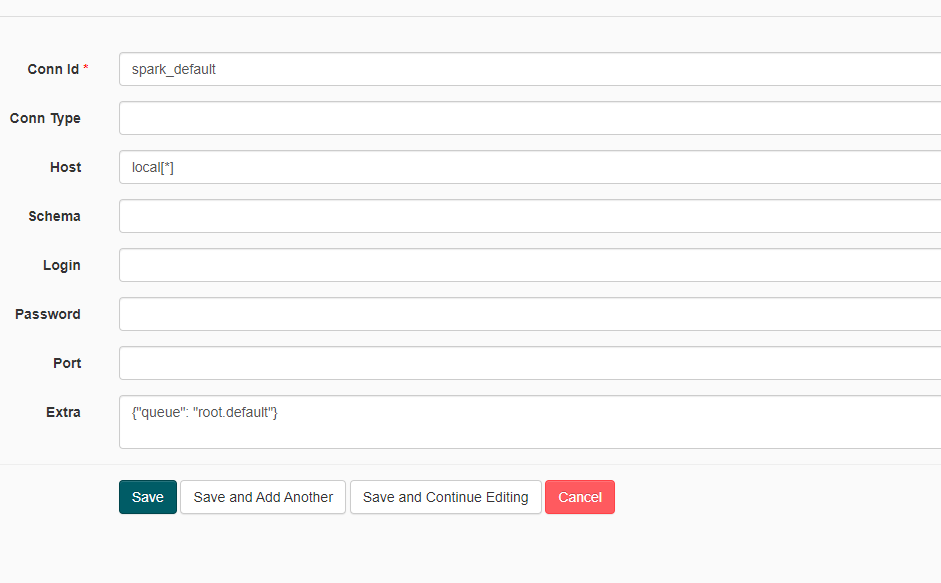
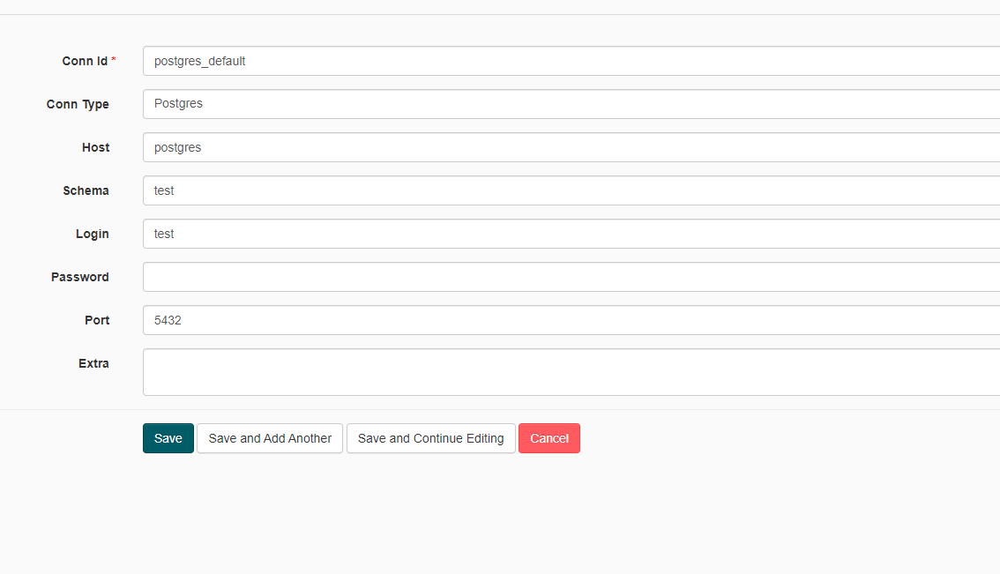
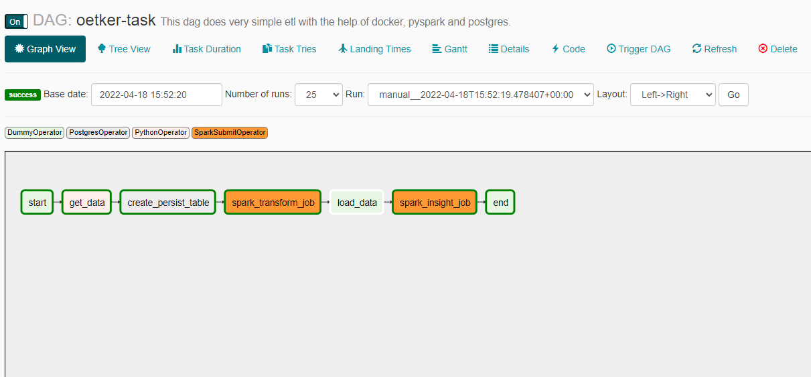

# Note: 

I have created two docker image already with custom librariries. So that, we dont need to build the docker
everytime we restart the machine.
Step to run the whole program is simple :

## Setup

### Clone project

    $ git clone https://github.com/mk-hasan/oetker-ts.git

### Start containers from docker folder

Navigate to airflow-spark/docker and:

    $ docker-compose up

If you want to run in background:

    $ docker-compose up -d


### Check if you can access

Airflow: http://localhost:8282

Spark Master: http://localhost:8181


## How to run a DAG to test

1. Configure spark connection acessing airflow web UI http://localhost:8282 and going to Connections
   

2. Edit the spark_default connection inserting `spark://spark` in Host field and Port `7077`
    

3. Run the spark-test DAG
   
4. Check the DAG log for the task spark_job. You will see the result printed in the log
   

5. Check the spark application in the Spark Master web UI (http://localhost:8181)
   


## Running the airflow DAG (Oetker-Task.dag)

### Access the Airflow UI 
Airflow: http://localhost:8282

Then change the two default connection properties:

 - spark-default
 - postgres-default 

Follow the settings in the following instructions:

1. Check the spark application in the Spark Master web UI (http://localhost:8181) and change the
    spark conn property to the follwoing:
   

1. For postgres change the postgres conn property to the follwoing:
   


There is only one dag inside the dag folder. You just have to trigger the dag to run. 



After running the dag succesfully, there will be a report generated in the spark/resources/report folder.


This is a simple report generated with some insight from the data.


# Airflow Spark


Note: when running the docker-compose for the first time, the images `postgres:9.6`, `mkhasan0007/bitnami-spark:3.1.2` and `mkhasan0007/docker-airflow-spark` will be downloaded before the containers started.


PostgreSql - Database Test:

* Server: localhost:5432
* Database: test
* User: test
* Password: postgres

Postgres - Database airflow:

* Server: localhost:5432
* Database: airflow
* User: airflow
* Password: airflow

This project contains the following containers:

* postgres: Postgres database for Airflow metadata and a Test database to test whatever you want.
    * Image: postgres:9.6
    * Database Port: 5432
    * References: https://hub.docker.com/_/postgres


I have created two custom image for airflow and spark with the required library.

* airflow-webserver: Airflow webserver and Scheduler.
    * Image: mkhasan0007/docker-airflow-spark:3.1.2
    * Port: 8282

* spark: Spark Master.
    * Image: mkhasan0007/bitnami-spark:3.1.2
    * Port: 8181
    * References: 
      * https://github.com/bitnami/bitnami-docker-spark
      * https://hub.docker.com/r/bitnami/spark/tags/?page=1&ordering=last_updated

* spark-worker-N: Spark workers. You can add workers copying the containers and changing the container name inside the docker-compose.yml file.
    * Image: bitnami/spark:3.1.2
    * References: 
      * https://github.com/bitnami/bitnami-docker-spark
      * https://hub.docker.com/r/bitnami/spark/tags/?page=1&ordering=last_updated
      

## Increasing the number of Spark Workers

You can increase the number of Spark workers just adding new services based on `bitnami/spark:3.1.2` image to the `docker-compose.yml` file like following:

```
spark-worker-n:
        image: bitnami/spark:3.1.2
        user: root
        networks:
            - default_net
        environment:
            - SPARK_MODE=worker
            - SPARK_MASTER_URL=spark://spark:7077
            - SPARK_WORKER_MEMORY=1G
            - SPARK_WORKER_CORES=1
            - SPARK_RPC_AUTHENTICATION_ENABLED=no
            - SPARK_RPC_ENCRYPTION_ENABLED=no
            - SPARK_LOCAL_STORAGE_ENCRYPTION_ENABLED=no
            - SPARK_SSL_ENABLED=no
        volumes:
            - ../spark/app:/usr/local/spark/app # Spark scripts folder (Must be the same path in airflow and Spark Cluster)
            - ../spark/resources/data:/usr/local/spark/resources/data #Data folder (Must be the same path in airflow and Spark Cluster)

```

## Adding Airflow Extra packages

Rebuild Dockerfile (in this example, adding GCP extra):

    $ docker build --rm --build-arg AIRFLOW_DEPS="gcp" -t docker-airflow-spark:1.10.7_3.1.2 .

After successfully built, run docker-compose to start container:

    $ docker-compose up

More info at: https://github.com/puckel/docker-airflow#build

## Useful docker commands

    List Images:
    $ docker images <repository_name>

    List Containers:
    $ docker container ls

    Check container logs:
    $ docker logs -f <container_name>

    To build a Dockerfile after changing sth (run inside directoty containing Dockerfile):
    $ docker build --rm -t <tag_name> .

    Access container bash:
    $ docker exec -i -t <container_name> /bin/bash

## Useful docker-compose commands

    Start Containers:
    $ docker-compose -f <compose-file.yml> up -d

    Stop Containers:
    $ docker-compose -f <compose-file.yml> down --remove-orphans
    
# Extras
## The report
I have made the report extra to just show that the program works and finds some insight.
